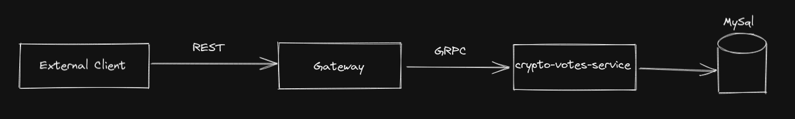

# go-microservice-sample

Project aim is share knowledge about golang, microservice, grpc, rest and database.

## Struct of project

I have inspiration on [this repo](https://github.com/golang-standards/project-layout) .

## Architecture of project


This diagram was made o [Excalidraw](https://excalidraw.com/)

## Setup

### Database

A complete instrunctions how to install and do a initial config of a database using golang, docker and MySql can be found on [this link](https://go.dev/doc/tutorial/database-access) of the offcial documentation.

I have set de password "admin" for this project and the user "root".

After this, must have create a database on the docker console image of the MySql:
`create database cryptos;`

And then:
`use cryptos;`

Run the script [Create_crypto_table.sql](scripts/database/init/Create_crypto_table.sql) for init the database.

## Commands

Use the next command for generating or updating of protobuf files:

```cmd
protoc --go_out=. --go_opt=paths=source_relative \
    --go-grpc_out=. --go-grpc_opt=paths=source_relative \
    api/helloworld.proto
```
